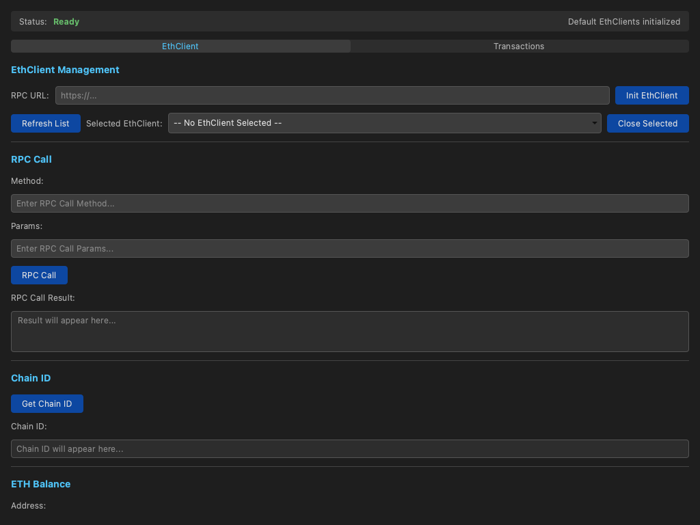
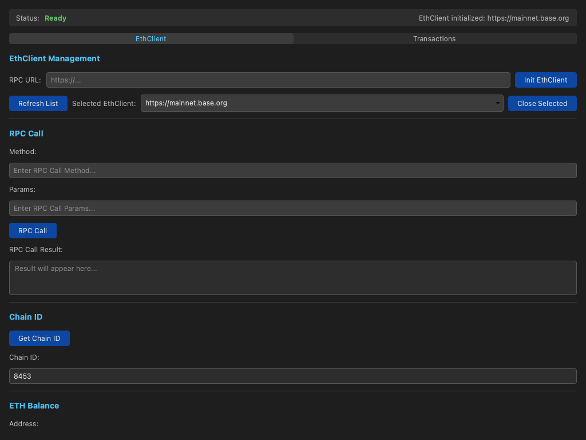

# Driving the Wallet UI Against This Module

The companion to the [headless runtime doc-test](wallet-module-runtime.md):
instead of calling `wallet_module` through the `logoscore` daemon, this one
drives the real **[`logos-wallet-ui`](https://github.com/logos-co/logos-wallet-ui)**
desktop app against **this** commit of the module.

`logos-wallet-ui` is a QML UI plugin built with
[`logos-app-builder`](https://github.com/logos-co/logos-app-builder), so its
flake exposes a standalone app (`apps.default`) that `nix run` launches in its
own window with all backend module dependencies bundled and auto-loaded. The
UI declares `wallet_module` as a flake input, so we build the app with an
`--override-input` that points that input at the commit under test. The UI then
talks to **this** module over the Logos IPC bridge, exactly as it would in
`logos-basecamp`.

The app is launched headless (`QT_QPA_PLATFORM=offscreen`) and driven through
the QML inspector via [`logos-qt-mcp`](https://github.com/logos-co/logos-qt-mcp):
we wait for the UI to come up, point it at a public Base mainnet RPC
endpoint, initialise an EthClient and ask the module for the chain ID — a real
`eth_chainId` round-trip that must return `8453` — and capture screenshots that
are embedded in the rendered tutorial and the CI report.

**What you'll build:** The `logos-wallet-ui` standalone app, built against this `wallet_module` commit and driven headlessly through its QML UI.

**What you'll learn:**

- How a UI built with `logos-app-builder` exposes a standalone `nix run` app
- How to override the UI's module input so it runs against a specific module commit
- How to drive a headless Qt/QML app with logos-qt-mcp (wait, type, click, assert)
- How to exercise a real module call end-to-end (init an EthClient, read the chain ID)
- How to capture screenshots of the running UI for documentation and CI reports

## Prerequisites

- **Nix** with flakes enabled. Install from [nixos.org](https://nixos.org/download.html), then enable flakes:

```bash
mkdir -p ~/.config/nix
echo 'experimental-features = nix-command flakes' >> ~/.config/nix/nix.conf
```

Verify: `nix flake --help >/dev/null 2>&1 && echo "Flakes enabled"`

- **A Linux or macOS machine.** The app runs headless via `QT_QPA_PLATFORM=offscreen`, so no display is required.

---

## How the standalone UI app works

`logos-wallet-ui` is a QML UI plugin (`wallet_ui`) that declares
`wallet_module` as a dependency. Because it is built with
`logos-app-builder`, its flake's `apps.default` is a self-contained desktop
app:

```
+--------------------+   backend.getChainId(rpcUrl)         +-----------------+
|     wallet_ui      | ----------------------------------->  |  wallet_module  |
|  WalletView.qml    |   IPC (Logos API bridge)              |   C++ plugin    |
+--------------------+                                       +-----------------+
          ^                                                          ^
          └──────────────── bundled & launched by ───────────────────┘
                          logos-app-builder standalone app
```

The standalone app bundles `wallet_module` and loads it automatically at
startup. On launch the backend immediately calls `wallet_module` to set up
its default EthClients; only when those calls succeed does the status reach
**Ready** — so a Ready status is itself proof that the UI is talking to the
module. By overriding the `wallet_module` input at build time we make that
backend **this** commit.

## Step 1: Clone the UI

Clone [`logos-wallet-ui`](https://github.com/logos-co/logos-wallet-ui). We
clone over HTTPS so the step works in CI; over SSH the URL is
`git@github.com:logos-co/logos-wallet-ui.git`.

### 1.1 git clone

```bash
git clone --depth 1 https://github.com/logos-co/logos-wallet-ui.git
```

---

## Step 2: Build the qt-mcp test driver

[`logos-qt-mcp`](https://github.com/logos-co/logos-qt-mcp) is the harness the
doc-test uses to connect to the app's QML inspector and drive it. Build it
once and link it as `./result-mcp`.

### 2.1 Build logos-qt-mcp

```bash
nix build 'github:logos-co/logos-qt-mcp' -o result-mcp
```

---

## Step 3: Launch the UI and exercise the module

Launch the standalone app with `nix run`, overriding the `wallet_module`
input so the UI runs against **this** commit of the module. The doc-test
drives the running app through a genuine round-trip: it points the UI at a
public Base mainnet RPC endpoint, initialises an EthClient (a real call into
`wallet_module`), and asks the module for the chain ID — which must come back
as `8453` for Base mainnet. That is end-to-end proof the module is loaded and
actually working, not just that the window rendered.

> `` pins the override to the commit under test (the runner expands
> it: locally this checkout's `HEAD`, in CI the commit being tested). With no
> pin it falls back to the module's latest `master`.
>
> This step makes a live JSON-RPC request to a public Base mainnet endpoint
> (`mainnet.base.org`), so it needs outbound network access.

### 3.1 Launch and drive the app

```bash
nix run ./logos-wallet-ui --override-input wallet_module github:logos-co/logos-wallet-module/28e5f85a3ca5c6b5ff3a0c332195b0961dca6c3c
```





This is a real end-to-end round-trip: typing the RPC URL and clicking
**Init EthClient** invokes `wallet_module.ethClientInit()` (which
auto-selects the new client), and **Get Chain ID** calls
`wallet_module.ethClientChainId()` — a live `eth_chainId` JSON-RPC request
dispatched through **this** module over the Logos API bridge. Base
mainnet answers `8453`, so seeing `8453` in the Chain ID field proves the
UI and this module work together against a real network. The captured
screenshots are embedded above and in the CI report.
